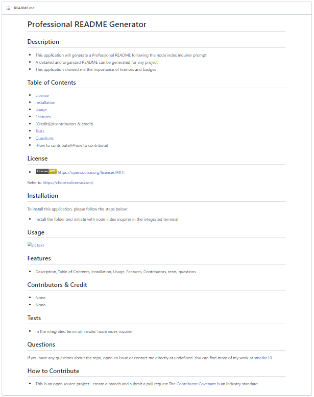

# Professional README Generator

## Description
- This application will generate a Professional README following the node index inquirer prompt
- A detailed and organized README can be generated for any project
- This application showed me the importance of licenses and badges

## Table of Contents

- [License](#license)
- [Installation](#installation)
- [Usage](#usage)
- [Features](#features)
- [Credits](#contributors & credit)
- [Tests](#tests)
- [Questions](#questions)
- [How to contribute](#how to contribute)

## License

- (https://opensource.org/licenses/MIT)

Refer to [https://choosealicense.com/](https://choosealicense.com/).

## Installation
To install this application, please follow the steps below:
- Install the folder and initiate with node index inquirer in the integrated terminal

## Usage

## Features

- Description, Table of Contents, Installation, Usage, Features, Contributors, tests, questions

## Contributors & Credit

- None
- None

## Tests

- In the integrated terminal, invoke 'node index inquirer'

## Questions 
If you have any questions about the repo, open an issue or contact me directly at undefined. You can find more of my work at [smeske10](https://github.com/smeske10/).

## How to Contribute

- This is an open source project - create a branch and submit a pull request
The [Contributor Covenant](https://www.contributor-covenant.org/) is an industry standard.

